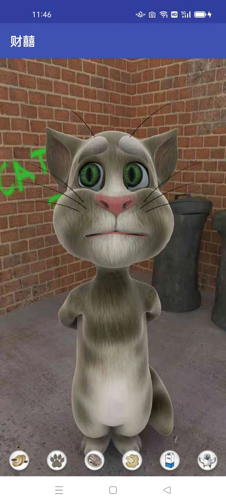

# ACat

Android 应用 另一只汤姆猫

使用信息熵处理机模拟小猫的大脑

## 特征

1.读取摄像头数据与用户交互

2.接收用户点击交互

3.小猫的表情

## 安装

下载安装apk文件

支持android 7.0以上的系统

## 开发

Android Studio 2021.1.1

python 3.8

[猫脑的设计](./app/src/main/assets/python/readme.md)

欢迎试用和领养!
